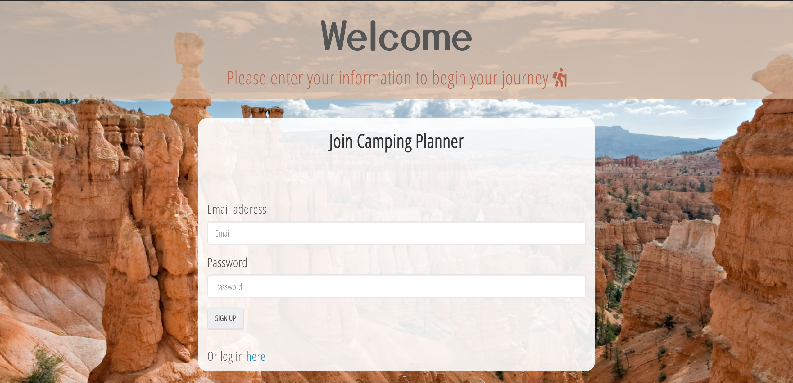

# Camping-Planner

<h3> Simplify planning, maximize experience. </h3>

## Table of Contents:

- [App Description](###App-description)
- [App Screenshots](###App-Screenshots)
- [Deployment](###Deployment)
- [Technologies Used](###Technologies-Used)
- [Contribute](###Contribute)
- [Credits](###Credits)
- [License](###License)

### App Description:

Camping Planner application uses a series of technologies to create a functioning app that allows users to choose from a list of national parks and in turn get back a series of details about their trip location, add and create an equipment list and select certain parks as favorites to store and look back on later.

When the user reaches the welcome screen, they will then be prompted to create a new username & password, or for returning users, enter their already created credentials. To store the user data, we have used dependencies Bycrptjs to hash password data and Passport to create the login/sign-up forms. Once logged in users will be prompted to choose from a list of states. Once a selection is made, the user will be routed to another list of National Parks that reside in the selected state. These lists are sourced from our SQL seed files, data from National Parks API (https://www.nps.gov/subjects/developer/api-documentation.htm).

Finally users will be routed to a page that holds information they will need for their trip such as the park address, link to the park website and weather data will be provided. This data will is able to be sent via email using Mailgun-js, this way users may share information with other trip goers. Another application feature is the ability to favorite parks and have them stored separately. This feature allows users to select certain parks that they may want to revisit for future trips or to help narrow down park choices.

The final feature is a checklist where users can select what they already own and as well as add items not on the list that they may still need. Once added and selected, users can go to a page where their completed personalized checklist will show. Users are then able to print the list or return to the location information page.

### App Screenshots

sign-up / Login screen

Choose from state list

Choose from park List

Park information page

When you favorite a location on previous page, find selected parks here:

Create your checklist

Then print your list for packing!

### Deployment:

<strong>Live Link:</strong> (https://campingplanner.herokuapp.com/)

### Technologies Used:

<ul>
<li>HTML/CSS</li>
<li>Javascript</li>
<li>Dependencies:
<ul>
    <li>bcryptjs (Store Username/password)</li>
    <li>Bootstrap</li>
    <li>Express</li>
    <li>Handlebars</li>
    <li>Mailgun-js (Send email function)</li>
    <li>MySQL</li>
    <li>Passport</li>
    <li>Sequelize</li>
</ul>
</li>

</ul>

### Contribute:

If you would like to contribute to this project, here are the steps to follow:

1. Fork the repository and clone it to your local machine.
   Create a new branch for the repository, create your changes in that branch.

2. Make sure to have all dependencies installed as listed in the package.json file.

3. In terminal source sql files to create database. Run npx sequelize-cli db:seed:all to add all location seeds. Run node server.js on localhost/8081.

4. Once your changes have been made and committed, submit your changes for review by creating a new pull request. If your changes are approved, they will then be merged into the main branch of the head repository.

5. Congrats! You have now contributed to our project.
   (for further details on how to contribute (https://github.com/firstcontributions/first-contributions))

### Usage:

This application uses Mailgun-js api. The free version takes a single email address as default. Though the syntax for this function is correct, in order to use this api for complete funtionality, a paid version will be required.

### Credits:

Jesse Persinger (@Mau5trap7791), Taylor Ceneviva (@taylorceneviva), Pavel Darii (@paveldarii), Ann Cooper-Miline (@amcmiline), Philip DiPaula (@pjdip)

### License:

MIT
